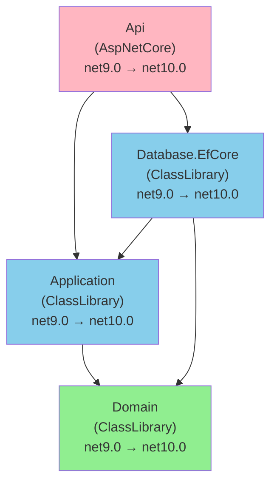

# .NET 10.0 Upgrade Plan

## Table of Contents

- [Executive Summary](#executive-summary)
- [Migration Strategy](#migration-strategy)
- [Detailed Dependency Analysis](#detailed-dependency-analysis)
- [Project-by-Project Migration Plans](#project-by-project-migration-plans)
- [Package Update Reference](#package-update-reference)
- [Breaking Changes Catalog](#breaking-changes-catalog)
- [Testing & Validation Strategy](#testing--validation-strategy)
- [Risk Management](#risk-management)
- [Complexity & Effort Assessment](#complexity--effort-assessment)
- [Source Control Strategy](#source-control-strategy)
- [Success Criteria](#success-criteria)

---

## Executive Summary

### Scenario Overview

**Objective**: Upgrade all projects in the Server solution from .NET 9.0 to .NET 10.0 (LTS)

**Scope**: 4 projects, 1,516 lines of code across 29 files

### Current State

All projects currently target `net9.0`:
- **Api** (AspNetCore application) - 140 LOC
- **Application** (Class library) - 143 LOC  
- **Domain** (Class library) - 108 LOC
- **EfCore/Database.EfCore** (Class library) - 1,125 LOC

### Target State

All projects will target `net10.0` with updated dependencies:
- 3 Entity Framework Core packages: `9.0.7` → `10.0.3`
- 2 compatible packages: No changes required (Npgsql.EntityFrameworkCore.PostgreSQL, Swashbuckle.AspNetCore)

### Selected Strategy

**All-At-Once Strategy** - All projects upgraded simultaneously in single atomic operation.

**Rationale**:
- **Small solution** (4 projects)
- **All currently on .NET 9.0** (homogeneous)
- **Simple dependency structure** (depth: 2, no cycles)
- **Low complexity** (all projects marked Low difficulty)
- **Clear compatibility** (0 breaking API changes detected)
- **All packages have target versions available**

### Complexity Assessment

**Classification: SIMPLE**

| Metric | Value | Assessment |
|---|---|---|
| Project Count | 4 | Small solution |
| Dependency Depth | 2 | Shallow hierarchy |
| Total LOC | 1,516 | Small codebase |
| Security Vulnerabilities | 0 | No urgent issues |
| High-Risk Projects | 0 | All marked Low difficulty |
| Breaking API Changes | 0 | Clean compatibility |

### Critical Considerations

1. **Entity Framework Core**: All three EF Core packages upgrade from `9.0.7` → `10.0.3` in coordinated manner
2. **No Breaking Changes Detected**: Assessment found 0 binary/source incompatible APIs across 1,570 analyzed APIs
3. **Database Provider**: Npgsql.EntityFrameworkCore.PostgreSQL `9.0.4` is compatible with EF Core `10.0.3`
4. **Zero Security Issues**: No vulnerable packages detected

### Implementation Approach

**Single atomic upgrade operation** updating all projects, followed by consolidated testing phase. Total estimated iterations: **8** (Foundation + Fast Batch details).

---

## Migration Strategy

### Approach Selection: All-At-Once

**Decision**: Upgrade all 4 projects simultaneously in a single atomic operation.

#### Justification

**Why All-At-Once is Appropriate:**

1. **Small Solution** (4 projects)
   - Well below the 30-project threshold
   - Can be upgraded and tested as a cohesive unit
   - Coordination complexity is manageable

2. **Homogeneous Technology Stack**
   - All projects on .NET 9.0
   - All projects moving to .NET 10.0
   - No mixed-framework complications

3. **Simple Dependency Structure**
   - Only 2 levels of depth
   - No circular dependencies
   - Clear, linear relationships

4. **Low Risk Profile**
   - 0 breaking API changes detected
   - All packages have compatible versions
   - 0 security vulnerabilities
   - All projects marked Low difficulty

5. **Package Compatibility**
   - All 3 packages requiring updates are EF Core (same family)
   - Clear upgrade path: `9.0.7` → `10.0.3`
   - Compatible database provider (Npgsql)

6. **Clean Assessment Results**
   - 1,570 APIs analyzed: 100% compatible
   - 0 files flagged for mandatory code changes
   - Expected 0 LOC modifications

#### All-At-Once Strategy Characteristics

**Execution Model:**
- All project files updated to `net10.0` in single operation
- All package references updated together
- Single restore and build pass for entire solution
- Unified compilation error resolution
- Consolidated testing phase

**Advantages for This Solution:**
- **Fastest completion** - No intermediate states or multi-targeting complexity
- **Simplified testing** - One comprehensive validation cycle
- **Clean dependency resolution** - All projects resolve against same framework version
- **Team efficiency** - Single coordinated effort, no phased rollout overhead

**Risk Mitigation:**
- Low baseline risk due to clean compatibility
- Single commit/rollback point
- Comprehensive test suite to catch integration issues

### Dependency-Based Ordering Rationale

While All-At-Once updates all projects simultaneously, the **logical dependency order** informs our understanding and testing approach:

**Logical Order** (for context only, not task boundaries):
1. **Domain** - Pure domain models, no external dependencies
2. **Application** - Business logic layer, depends on Domain
3. **Database.EfCore** - Data access layer, depends on Domain + Application
4. **Api** - ASP.NET Core host, depends on Application + Database.EfCore

**Testing Order** (follows dependencies):
- Build entire solution (all projects together)
- If issues arise, investigate from leaf to root (Domain → Application → EfCore → Api)
- Functional testing focuses on Api (entry point)

### Parallel vs Sequential Execution

**Decision**: Sequential within atomic upgrade, parallel not applicable.

Since All-At-Once treats the upgrade as a single atomic operation:
- All project file updates happen together
- All package updates happen together
- Single build validates all projects simultaneously

**No parallelization needed** - the atomic nature provides inherent efficiency.

### Phase Definitions

#### Phase 0: Preparation
**Scope**: Environment validation  
**Deliverables**: .NET 10 SDK verified, Git state clean

#### Phase 1: Atomic Upgrade
**Scope**: All projects, all packages, all compilation fixes  
**Operations** (single coordinated batch):
- Update all project files to `net10.0`
- Update all EF Core packages to `10.0.3`
- Restore dependencies
- Build solution and fix any compilation errors
- Verify solution builds with 0 errors

**Deliverables**: Solution builds successfully

#### Phase 2: Validation
**Scope**: Comprehensive testing  
**Operations**:
- Execute all tests
- Verify application functionality
- Confirm 0 warnings/vulnerabilities

**Deliverables**: All tests pass, solution validated

---

## Detailed Dependency Analysis

### Dependency Graph Summary

The solution has a clean, acyclic dependency structure with 2 levels of depth:

```
Level 0 (Leaf):
  └─ Domain (no dependencies)

Level 1 (Middle):
  ├─ Application (depends on: Domain)
  └─ EfCore/Database.EfCore (depends on: Domain, Application)

Level 2 (Root):
  └─ Api (depends on: Application, Database.EfCore)
```

**Mermaid Visualization:**



### Project Groupings for All-At-Once Migration

Since this is an **All-At-Once Strategy**, all projects upgrade simultaneously. However, for context and understanding, here's the logical dependency ordering:

**Migration Group: All Projects (Atomic Operation)**
- Domain (0 dependencies - leaf)
- Application (1 dependency: Domain)
- Database.EfCore (2 dependencies: Domain, Application)
- Api (2 dependencies: Application, Database.EfCore)

**Key Insight**: While projects have dependencies, the All-At-Once approach updates all `TargetFramework` properties and package references in a single coordinated operation, then builds the entire solution together.

### Critical Path

**Domain → Application → Database.EfCore → Api**

This represents the longest dependency chain in the solution. All four projects lie on the critical path, meaning coordination across all projects is essential.

### Circular Dependencies

**Status**: ✅ None detected

The dependency graph is a proper directed acyclic graph (DAG), which simplifies the upgrade process.

### Special Considerations

1. **Shared Dependency**: `Domain` is consumed by both `Application` and `Database.EfCore`
2. **EF Core Coordination**: `Database.EfCore` contains the DbContext and must coordinate with both:
   - `Application` (which also references EF Core)
   - `Api` (which hosts the application)
3. **ASP.NET Core Host**: `Api` is the entry point and must be validated last during testing

---

## Project-by-Project Migration Plans

### Project: Domain\Domain.csproj

**Current State**: `net9.0`, ClassLibrary, 0 dependencies, 108 LOC, 6 files  
**Target State**: `net10.0`  
**Risk Level**: 🟢 Low

[Details to be filled]

---

### Project: Application\Application.csproj

**Current State**: `net9.0`, ClassLibrary, 1 dependency (Domain), 143 LOC, 8 files  
**Target State**: `net10.0`  
**Risk Level**: 🟢 Low

#### Migration Steps

**1. Prerequisites**
- Domain project updated to `net10.0` (part of atomic operation)

**2. Framework Update**
- Update `<TargetFramework>` in `Application\Application.csproj`: `net9.0` → `net10.0`

**3. Package/Dependency Updates**

| Package | Current Version | Target Version | Reason |
|---|---|---|---|
| `Microsoft.EntityFrameworkCore` | 9.0.7 | 10.0.3 | Framework compatibility, recommended upgrade |

**4. Expected Breaking Changes**

Assessment found **0 breaking changes** for this project:
- 154 APIs analyzed: 100% compatible
- 0 binary incompatible changes
- 0 source incompatible changes
- 0 behavioral changes

**Expected Impact**: None. EF Core 10.0 maintains API compatibility with 9.0.

**Potential Considerations**:
- EF Core 10.0 may have performance improvements or query translation enhancements
- LINQ query patterns should remain unchanged
- DbContext usage patterns remain compatible

**5. Code Modifications**

Assessment indicates **0 LOC modifications required**.

**Review Areas** (if issues arise):
- Entity configuration patterns
- Query expressions using EF Core
- Any custom value converters or type mappings
- Dependency injection registrations for EF Core services

**6. Testing Strategy**

- **Build Test**: Project compiles without errors or warnings
- **Dependency Test**: Api project can still reference Application
- **Integration Test**: EF Core queries function correctly with updated package
- **No Unit Tests**: Application project contains no test files

**7. Validation Checklist**

- [ ] Application.csproj builds without errors
- [ ] Application.csproj builds without warnings
- [ ] EF Core package restored successfully
- [ ] No package version conflicts
- [ ] Dependent project (Api) still builds correctly

---

### Project: EfCore\Database.EfCore.csproj

**Current State**: `net9.0`, ClassLibrary, 2 dependencies (Domain, Application), 1,125 LOC, 12 files  
**Target State**: `net10.0`  
**Risk Level**: 🟢 Low

#### Migration Steps

**1. Prerequisites**
- Domain project updated to `net10.0` (part of atomic operation)
- Application project updated to `net10.0` (part of atomic operation)

**2. Framework Update**
- Update `<TargetFramework>` in `EfCore\Database.EfCore.csproj`: `net9.0` → `net10.0`

**3. Package/Dependency Updates**

| Package | Current Version | Target Version | Reason |
|---|---|---|---|
| `Microsoft.EntityFrameworkCore` | 9.0.7 | 10.0.3 | Framework compatibility, recommended upgrade |
| `Microsoft.EntityFrameworkCore.Design` | 9.0.7 | 10.0.3 | Framework compatibility, recommended upgrade |
| `Npgsql.EntityFrameworkCore.PostgreSQL` | 9.0.4 | (no change) | ✅ Compatible with EF Core 10.0.3 |

**4. Expected Breaking Changes**

Assessment found **0 breaking changes** for this project:
- 1,156 APIs analyzed: 100% compatible
- 0 binary incompatible changes
- 0 source incompatible changes
- 0 behavioral changes

**Expected Impact**: Minimal. EF Core 10.0 is API-compatible with 9.0.

**Database Context Considerations**:
- `MealPlannerDbContext` inherits from `DbContext` - no signature changes expected
- `ApplyConfigurationsFromAssembly` pattern remains supported
- DbSet properties maintain same interface
- Configuration classes using `IEntityTypeConfiguration<T>` remain compatible

**Npgsql Provider**:
- Current version `9.0.4` is compatible with EF Core `10.0.3`
- No provider-specific breaking changes anticipated
- PostgreSQL compatibility maintained

**5. Code Modifications**

Assessment indicates **0 LOC modifications required**.

**Review Areas** (if issues arise):
- `MealPlannerDbContext.cs` - DbContext configuration
- Entity configuration classes (implementing `IEntityTypeConfiguration<T>`)
- Migration files (may remain unchanged, new migrations use EF 10 conventions)
- Any custom database functions or raw SQL
- Value converters or custom type mappings

**6. Testing Strategy**

- **Build Test**: Project compiles without errors or warnings
- **Database Test**: Migrations apply successfully
- **Query Test**: All LINQ queries translate correctly
- **Provider Test**: Npgsql provider works with EF Core 10.0
- **Context Test**: DbContext initialization and operations function correctly
- **No Unit Tests**: Database.EfCore project contains no test files

**7. Validation Checklist**

- [ ] Database.EfCore.csproj builds without errors
- [ ] Database.EfCore.csproj builds without warnings
- [ ] All EF Core packages restored successfully
- [ ] No package version conflicts between EF Core packages
- [ ] Npgsql provider compatible with EF Core 10.0.3
- [ ] Dependent project (Api) still builds correctly
- [ ] Database migrations can be generated (if applicable)

---

### Project: Domain\Domain.csproj

**Current State**: `net9.0`, ClassLibrary, 0 dependencies, 108 LOC, 6 files  
**Target State**: `net10.0`  
**Risk Level**: 🟢 Low

#### Migration Steps

**1. Prerequisites**
- None (leaf project with no dependencies)

**2. Framework Update**
- Update `<TargetFramework>` in `Domain\Domain.csproj`: `net9.0` → `net10.0`

**3. Package/Dependency Updates**

*No package updates required* - Domain has no NuGet package dependencies.

**4. Expected Breaking Changes**

Assessment found **0 breaking changes** for this project:
- 116 APIs analyzed: 100% compatible
- 0 binary incompatible changes
- 0 source incompatible changes
- 0 behavioral changes

**Expected Impact**: None. Pure domain model classes with no framework-specific patterns.

**5. Code Modifications**

Assessment indicates **0 LOC modifications required**.

**Potential Areas to Review** (if build issues occur):
- Domain model attributes (should remain unchanged)
- Constructor patterns (no changes expected)
- Property definitions (C# 13 features remain compatible)

**6. Testing Strategy**

- **Build Test**: Project compiles without errors or warnings
- **Dependency Test**: Application and Database.EfCore projects can still reference Domain
- **No Unit Tests**: Domain project contains no test files

**7. Validation Checklist**

- [ ] Domain.csproj builds without errors
- [ ] Domain.csproj builds without warnings
- [ ] Dependent projects (Application, Database.EfCore) still build correctly
- [ ] No changes to public API surface

---

### Project: Application\Application.csproj

**Current State**: `net9.0`, ClassLibrary, 1 dependency (Domain), 143 LOC, 8 files  
**Target State**: `net10.0`  
**Risk Level**: 🟢 Low

#### Migration Steps

**1. Prerequisites**
- Domain project updated to `net10.0` (part of atomic operation)

**2. Framework Update**
- Update `<TargetFramework>` in `Application\Application.csproj`: `net9.0` → `net10.0`

**3. Package/Dependency Updates**

| Package | Current Version | Target Version | Reason |
|---|---|---|---|
| `Microsoft.EntityFrameworkCore` | 9.0.7 | 10.0.3 | Framework compatibility, recommended upgrade |

**4. Expected Breaking Changes**

Assessment found **0 breaking changes** for this project:
- 154 APIs analyzed: 100% compatible
- 0 binary incompatible changes
- 0 source incompatible changes
- 0 behavioral changes

**Expected Impact**: None. EF Core 10.0 maintains API compatibility with 9.0.

**Potential Considerations**:
- EF Core 10.0 may have performance improvements or query translation enhancements
- LINQ query patterns should remain unchanged
- DbContext usage patterns remain compatible

**5. Code Modifications**

Assessment indicates **0 LOC modifications required**.

**Review Areas** (if issues arise):
- Entity configuration patterns
- Query expressions using EF Core
- Any custom value converters or type mappings
- Dependency injection registrations for EF Core services

**6. Testing Strategy**

- **Build Test**: Project compiles without errors or warnings
- **Dependency Test**: Api project can still reference Application
- **Integration Test**: EF Core queries function correctly with updated package
- **No Unit Tests**: Application project contains no test files

**7. Validation Checklist**

- [ ] Application.csproj builds without errors
- [ ] Application.csproj builds without warnings
- [ ] EF Core package restored successfully
- [ ] No package version conflicts
- [ ] Dependent project (Api) still builds correctly

---

### Project: EfCore\Database.EfCore.csproj

**Current State**: `net9.0`, ClassLibrary, 2 dependencies (Domain, Application), 1,125 LOC, 12 files  
**Target State**: `net10.0`  
**Risk Level**: 🟢 Low

#### Migration Steps

**1. Prerequisites**
- Domain project updated to `net10.0` (part of atomic operation)
- Application project updated to `net10.0` (part of atomic operation)

**2. Framework Update**
- Update `<TargetFramework>` in `EfCore\Database.EfCore.csproj`: `net9.0` → `net10.0`

**3. Package/Dependency Updates**

| Package | Current Version | Target Version | Reason |
|---|---|---|---|
| `Microsoft.EntityFrameworkCore` | 9.0.7 | 10.0.3 | Framework compatibility, recommended upgrade |
| `Microsoft.EntityFrameworkCore.Design` | 9.0.7 | 10.0.3 | Framework compatibility, recommended upgrade |
| `Npgsql.EntityFrameworkCore.PostgreSQL` | 9.0.4 | (no change) | ✅ Compatible with EF Core 10.0.3 |

**4. Expected Breaking Changes**

Assessment found **0 breaking changes** for this project:
- 1,156 APIs analyzed: 100% compatible
- 0 binary incompatible changes
- 0 source incompatible changes
- 0 behavioral changes

**Expected Impact**: Minimal. EF Core 10.0 is API-compatible with 9.0.

**Database Context Considerations**:
- `MealPlannerDbContext` inherits from `DbContext` - no signature changes expected
- `ApplyConfigurationsFromAssembly` pattern remains supported
- DbSet properties maintain same interface
- Configuration classes using `IEntityTypeConfiguration<T>` remain compatible

**Npgsql Provider**:
- Current version `9.0.4` is compatible with EF Core `10.0.3`
- No provider-specific breaking changes anticipated
- PostgreSQL compatibility maintained

**5. Code Modifications**

Assessment indicates **0 LOC modifications required**.

**Review Areas** (if issues arise):
- `MealPlannerDbContext.cs` - DbContext configuration
- Entity configuration classes (implementing `IEntityTypeConfiguration<T>`)
- Migration files (may remain unchanged, new migrations use EF 10 conventions)
- Any custom database functions or raw SQL
- Value converters or custom type mappings

**6. Testing Strategy**

- **Build Test**: Project compiles without errors or warnings
- **Database Test**: Migrations apply successfully
- **Query Test**: All LINQ queries translate correctly
- **Provider Test**: Npgsql provider works with EF Core 10.0
- **Context Test**: DbContext initialization and operations function correctly
- **No Unit Tests**: Database.EfCore project contains no test files

**7. Validation Checklist**

- [ ] Database.EfCore.csproj builds without errors
- [ ] Database.EfCore.csproj builds without warnings
- [ ] All EF Core packages restored successfully
- [ ] No package version conflicts between EF Core packages
- [ ] Npgsql provider compatible with EF Core 10.0.3
- [ ] Dependent project (Api) still builds correctly
- [ ] Database migrations can be generated (if applicable)

---

### Project: Api\Api.csproj

**Current State**: `net9.0`, AspNetCore, 2 dependencies (Application, Database.EfCore), 140 LOC, 5 files  
**Target State**: `net10.0`  
**Risk Level**: 🟢 Low

#### Migration Steps

**1. Prerequisites**
- Application project updated to `net10.0` (part of atomic operation)
- Database.EfCore project updated to `net10.0` (part of atomic operation)
- Domain project updated to `net10.0` (part of atomic operation)

**2. Framework Update**
- Update `<TargetFramework>` in `Api\Api.csproj`: `net9.0` → `net10.0`

**3. Package/Dependency Updates**

| Package | Current Version | Target Version | Reason |
|---|---|---|---|
| `Microsoft.EntityFrameworkCore` | 9.0.7 | 10.0.3 | Framework compatibility, recommended upgrade |
| `Microsoft.EntityFrameworkCore.Tools` | 9.0.7 | 10.0.3 | Framework compatibility, recommended upgrade |
| `Swashbuckle.AspNetCore` | 9.0.3 | (no change) | ✅ Compatible with .NET 10 |

**4. Expected Breaking Changes**

Assessment found **0 breaking changes** for this project:
- 144 APIs analyzed: 100% compatible
- 0 binary incompatible changes
- 0 source incompatible changes
- 0 behavioral changes

**Expected Impact**: Minimal. ASP.NET Core 10.0 maintains compatibility with 9.0 patterns.

**ASP.NET Core Considerations**:
- Minimal API patterns (if used) remain compatible
- Dependency injection registration patterns unchanged
- Middleware pipeline configuration unchanged
- Controller patterns (if used) remain compatible
- Swagger/OpenAPI integration via Swashbuckle remains functional

**5. Code Modifications**

Assessment indicates **0 LOC modifications required**.

**Review Areas** (if issues arise):
- `Program.cs` - Application startup and configuration
- Controller classes (if present)
- Middleware configuration
- Dependency injection service registrations
- Database context registration (`AddDbContext` patterns)
- Swagger configuration

**6. Testing Strategy**

- **Build Test**: Project compiles without errors or warnings
- **Startup Test**: Application starts without errors
- **API Test**: All endpoints respond correctly
- **Database Test**: EF Core integration functions correctly
- **Swagger Test**: API documentation generates correctly
- **Integration Test**: End-to-end request/response cycles work
- **No Unit Tests**: Api project contains no test files

**7. Validation Checklist**

- [ ] Api.csproj builds without errors
- [ ] Api.csproj builds without warnings
- [ ] All packages restored successfully
- [ ] No package version conflicts
- [ ] Application starts successfully
- [ ] Swagger UI accessible (if applicable)
- [ ] Database connectivity works
- [ ] API endpoints respond correctly
- [ ] No runtime exceptions during startup

---

## Package Update Reference

### Overview

**Total Packages**: 5  
**Packages Requiring Updates**: 3 (60%)  
**Packages Compatible**: 2 (40%)

### Common Package Updates (Affecting Multiple Projects)

| Package | Current | Target | Projects Affected | Update Reason |
|---|---|---|---|---|
| `Microsoft.EntityFrameworkCore` | 9.0.7 | 10.0.3 | 3 projects (Api, Application, Database.EfCore) | Framework compatibility |

### Project-Specific Package Updates

#### Api\Api.csproj (2 updates, 1 compatible)

| Package | Current | Target | Status |
|---|---|---|---|
| `Microsoft.EntityFrameworkCore` | 9.0.7 | 10.0.3 | 🔄 Update |
| `Microsoft.EntityFrameworkCore.Tools` | 9.0.7 | 10.0.3 | 🔄 Update |
| `Swashbuckle.AspNetCore` | 9.0.3 | (no change) | ✅ Compatible |

#### Application\Application.csproj (1 update)

| Package | Current | Target | Status |
|---|---|---|---|
| `Microsoft.EntityFrameworkCore` | 9.0.7 | 10.0.3 | 🔄 Update |

#### EfCore\Database.EfCore.csproj (2 updates, 1 compatible)

| Package | Current | Target | Status |
|---|---|---|---|
| `Microsoft.EntityFrameworkCore` | 9.0.7 | 10.0.3 | 🔄 Update |
| `Microsoft.EntityFrameworkCore.Design` | 9.0.7 | 10.0.3 | 🔄 Update |
| `Npgsql.EntityFrameworkCore.PostgreSQL` | 9.0.4 | (no change) | ✅ Compatible |

#### Domain\Domain.csproj (0 packages)

No NuGet package dependencies.

### Package Update Instructions

**All package updates should be applied simultaneously as part of the atomic upgrade operation.**

For each `.csproj` file, update `<PackageReference>` elements:

```xml
<!-- Before -->
<PackageReference Include="Microsoft.EntityFrameworkCore" Version="9.0.7" />

<!-- After -->
<PackageReference Include="Microsoft.EntityFrameworkCore" Version="10.0.3" />
```

### Package Compatibility Matrix

| Package Family | Version Range | .NET 10 Compatible | Notes |
|---|---|---|---|
| Entity Framework Core | 10.0.x | ✅ Yes | Recommended version: 10.0.3 |
| Npgsql.EntityFrameworkCore.PostgreSQL | 9.0.4+ | ✅ Yes | No update required |
| Swashbuckle.AspNetCore | 9.0.3+ | ✅ Yes | No update required |

---

## Breaking Changes Catalog

### Summary

**Assessment Result**: ✅ **No breaking changes detected**

The compatibility analysis examined **1,570 APIs** across all projects and found:
- 0 binary incompatible changes
- 0 source incompatible changes  
- 0 behavioral changes
- 1,570 compatible APIs (100%)

### .NET 9.0 → .NET 10.0 Framework Changes

**Expected Breaking Changes**: Minimal to none for this codebase.

.NET 10.0 maintains strong backward compatibility with .NET 9.0. The upgrade primarily brings:
- Performance improvements
- New optional features
- Enhanced tooling support

**Potential Areas to Monitor** (general .NET 10 considerations):
- New analyzer warnings (may appear as build warnings)
- Improved null reference analysis (may surface new warnings)
- Enhanced pattern matching (existing code remains compatible)

### Entity Framework Core 9.0 → 10.0 Changes

**Expected Breaking Changes**: None for this codebase's usage patterns.

EF Core 10.0 is API-compatible with 9.0 for standard scenarios like those used in this solution:
- `DbContext` patterns ✅ Compatible
- `DbSet<T>` usage ✅ Compatible
- `IEntityTypeConfiguration<T>` ✅ Compatible
- `ApplyConfigurationsFromAssembly` ✅ Compatible
- LINQ query patterns ✅ Compatible

**Potential Behavioral Improvements**:
- Query translation enhancements (may generate more efficient SQL)
- Performance optimizations (faster query execution)
- Improved diagnostics and logging

**Reference**: [EF Core 10.0 Release Notes](https://learn.microsoft.com/en-us/ef/core/what-is-new/ef-core-10.0/whatsnew)

### ASP.NET Core 9.0 → 10.0 Changes

**Expected Breaking Changes**: None for this codebase.

ASP.NET Core 10.0 maintains compatibility with 9.0 patterns:
- Minimal API patterns ✅ Compatible
- Controller-based APIs ✅ Compatible
- Dependency injection ✅ Compatible
- Middleware pipeline ✅ Compatible
- Swagger/OpenAPI integration ✅ Compatible (via Swashbuckle)

**Reference**: [ASP.NET Core 10.0 Release Notes](https://learn.microsoft.com/en-us/aspnet/core/release-notes/aspnetcore-10.0)

### Package-Specific Changes

#### Microsoft.EntityFrameworkCore.Tools (9.0.7 → 10.0.3)
- Tooling updates for migration commands
- No impact on application code
- Used for `dotnet ef` CLI operations

#### Npgsql.EntityFrameworkCore.PostgreSQL (9.0.4 - No Change)
- Already compatible with EF Core 10.0
- No provider-specific changes needed

#### Swashbuckle.AspNetCore (9.0.3 - No Change)
- Already compatible with ASP.NET Core 10.0
- No OpenAPI/Swagger changes needed

### Project-Specific Considerations

#### Domain
- **Breaking Changes**: None
- **Risk**: Minimal (pure domain models, no framework-specific patterns)

#### Application  
- **Breaking Changes**: None
- **Risk**: Low (standard EF Core usage patterns)

#### Database.EfCore
- **Breaking Changes**: None
- **Risk**: Low (standard DbContext patterns, compatible provider)
- **Note**: Contains most LOC (1,125) but uses conventional patterns

#### Api
- **Breaking Changes**: None
- **Risk**: Low (standard ASP.NET Core patterns)

### What to Do If Breaking Changes Appear

Despite clean assessment, unexpected issues may arise:

1. **Compilation Errors**:
   - Check error message against [official breaking changes documentation](https://learn.microsoft.com/en-us/dotnet/core/compatibility/10.0)
   - Search for specific API in .NET 10 documentation
   - Check EF Core or ASP.NET Core specific release notes

2. **New Warnings**:
   - Review C# 13 and .NET 10 analyzer warnings
   - Address nullable reference warnings
   - Fix obsolete API warnings (if any appear)

3. **Runtime Behavioral Changes**:
   - Compare test results between .NET 9 and .NET 10
   - Check for EF Core query translation differences
   - Monitor application logs for unexpected behavior

### Reference Documentation

- [.NET 10 Breaking Changes](https://learn.microsoft.com/en-us/dotnet/core/compatibility/10.0)
- [EF Core 10.0 What's New](https://learn.microsoft.com/en-us/ef/core/what-is-new/ef-core-10.0/whatsnew)
- [ASP.NET Core 10.0 What's New](https://learn.microsoft.com/en-us/aspnet/core/release-notes/aspnetcore-10.0)

---

## Testing & Validation Strategy

### Overview

Since this is an **All-At-Once Strategy** upgrade, testing occurs after the complete atomic upgrade operation. The strategy focuses on comprehensive solution-level validation.

### Testing Levels

#### Level 1: Build Validation (Immediate)

**Performed**: Immediately after atomic upgrade completes

**Scope**: Entire solution

**Tests**:
- ✅ All 4 projects compile without errors
- ✅ All 4 projects compile without warnings
- ✅ No package restore errors
- ✅ No package version conflicts

**Success Criteria**: Solution builds successfully with 0 errors, 0 warnings

**If Build Fails**:
1. Review compilation errors
2. Check against [Breaking Changes Catalog](#breaking-changes-catalog)
3. Fix identified issues
4. Rebuild to verify fixes
5. Repeat until clean build achieved

#### Level 2: Test Execution (Post-Build)

**Performed**: After successful solution build

**Scope**: All test projects (if any exist)

**Current State**: Assessment indicates no test projects detected in solution

**Tests** (if test projects discovered):
- Unit tests for Domain models
- Integration tests for Application services
- Database tests for EfCore operations
- API tests for Api endpoints

**Success Criteria**: All discovered tests pass

#### Level 3: Smoke Testing (Manual)

**Performed**: After automated tests pass (or if no tests exist)

**Scope**: Critical application paths

**Tests**:
1. **Application Startup**
   - Api project starts without exceptions
   - No startup configuration errors
   - Database connection established

2. **Database Operations**
   - DbContext can connect to PostgreSQL
   - Basic CRUD operations function
   - Migrations are compatible (if applicable)

3. **API Endpoints**
   - Swagger UI loads (if configured)
   - Sample API requests succeed
   - Response serialization works correctly

4. **Entity Framework Operations**
   - Query translation to SQL succeeds
   - Change tracking functions correctly
   - SaveChanges operations work

**Success Criteria**: All critical paths function as expected

#### Level 4: Regression Validation (Recommended)

**Performed**: After smoke testing passes

**Scope**: Compare .NET 9.0 vs .NET 10.0 behavior

**Tests**:
- Functional equivalence for all API endpoints
- Performance comparison (should be equal or better)
- Database query output comparison
- Log output review for unexpected changes

**Success Criteria**: No behavioral regressions detected

### Testing Sequence (All-At-Once)

Since all projects upgrade simultaneously:

```
Phase 1: Atomic Upgrade
  ├─ Update all project files
  ├─ Update all packages
  ├─ Restore dependencies
  ├─ Build solution
  └─ Fix compilation errors (if any)
       └─ SUCCESS: Solution builds ✓

Phase 2: Validation
  ├─ Level 1: Build Validation ✓
  ├─ Level 2: Execute tests (if test projects exist)
  ├─ Level 3: Smoke testing (manual)
  └─ Level 4: Regression validation
       └─ SUCCESS: All validation passed ✓
```

### Test Project Discovery

**Current Assessment**: No test projects detected

**Action**: During execution, verify if test projects exist:
```bash
# Search for test projects
dotnet sln list | Select-String -Pattern "test|spec"
```

**If Found**: Include in Level 2 testing  
**If Not Found**: Proceed directly to Level 3 smoke testing

### Validation Checkpoints

#### Checkpoint 1: Build Success
- [ ] All 4 projects build without errors
- [ ] 0 package restore warnings
- [ ] 0 compilation warnings
- [ ] No dependency version conflicts

#### Checkpoint 2: Test Success (if applicable)
- [ ] All unit tests pass
- [ ] All integration tests pass
- [ ] No test infrastructure errors

#### Checkpoint 3: Smoke Test Success
- [ ] Application starts without errors
- [ ] Database connectivity confirmed
- [ ] API endpoints respond correctly
- [ ] No runtime exceptions in logs

#### Checkpoint 4: Regression Validation
- [ ] Functionality matches .NET 9.0 baseline
- [ ] Performance acceptable
- [ ] No unexpected behavioral changes

### Rollback Triggers

Initiate rollback if:
- Build cannot be resolved after reasonable troubleshooting
- Critical tests fail without clear resolution path
- Severe performance degradation detected
- Data integrity issues observed
- Application fails to start after multiple fix attempts

### Performance Testing Considerations

**Baseline Metrics** (capture before upgrade):
- API endpoint response times
- Database query execution times
- Application startup time
- Memory consumption

**Post-Upgrade Validation**:
- Compare against baseline
- .NET 10 should be equal or better performance
- Investigate any regressions > 10%

---

## Risk Management

### Overall Risk Assessment

**Risk Level**: 🟢 **LOW**

This upgrade presents minimal risk due to:
- Clean compatibility (0 breaking API changes detected)
- Small codebase (1,516 LOC)
- Simple structure (4 projects, no cycles)
- Homogeneous framework versions (all on .NET 9.0)
- No security vulnerabilities
- All packages have clear upgrade paths

### High-Risk Changes

| Project | Risk Level | Description | Mitigation |
|---|---|---|---|
| *None identified* | — | Assessment found no high-risk changes | Standard validation procedures sufficient |

### Potential Issues & Mitigation

| Potential Issue | Likelihood | Impact | Mitigation Strategy |
|---|---|---|---|
| **EF Core behavior changes** | Low | Medium | Review EF Core 10.0 release notes; validate all database operations in testing |
| **Compilation errors from framework updates** | Low | Low | Address during build phase using breaking changes documentation |
| **Runtime behavior differences** | Low | Low | Comprehensive testing phase includes functional validation |
| **Build cache conflicts** | Very Low | Low | Clean build after framework update |

### Security Vulnerabilities

**Status**: ✅ No security vulnerabilities detected in current packages

All packages are up-to-date with no known CVEs.

### Contingency Plans

#### If Build Fails After Framework Update
1. Review compilation errors against [Breaking Changes Catalog](#breaking-changes-catalog)
2. Check for unexpected package incompatibilities
3. Verify .NET 10 SDK is correctly installed
4. Consult EF Core 10.0 migration documentation if EF-related errors appear

#### If Tests Fail
1. Isolate failing test(s)
2. Check for behavioral changes in EF Core 10.0
3. Review database provider compatibility
4. Verify configuration/dependency injection patterns still valid

#### If Application Runtime Issues
1. Enable detailed logging
2. Compare behavior with .NET 9.0 baseline
3. Check for EF Core query translation differences
4. Verify middleware pipeline unchanged

### Rollback Plan

**Rollback Mechanism**: Git branch reversion

**Steps**:
1. Document issues encountered
2. `git checkout dev` (return to source branch)
3. `git branch -D upgrade-to-NET10` (delete upgrade branch)
4. Analyze issues and adjust plan if needed
5. Retry with updated approach

**Recovery Time**: < 5 minutes (simple branch switch)

---

## Complexity & Effort Assessment

### Per-Project Complexity

| Project | Complexity | Dependencies | Risk | Package Updates | Notes |
|---|---|---|---|---|---|
| **Domain** | 🟢 Low | 0 | Low | 0 | Pure domain models, framework change only |
| **Application** | 🟢 Low | 1 | Low | 1 | Business logic, single EF Core package |
| **Database.EfCore** | 🟢 Low | 2 | Low | 2 | Data layer, multiple EF Core packages |
| **Api** | 🟢 Low | 2 | Low | 2 | ASP.NET Core host, entry point |

### Phase Complexity Assessment

#### Phase 0: Preparation
**Complexity**: 🟢 Low  
**Effort**: Minimal verification steps

#### Phase 1: Atomic Upgrade
**Complexity**: 🟢 Low  
**Effort**: Medium

**Factors**:
- 4 project files to update
- 3 package references to update
- Expected 0 compilation errors (based on API compatibility analysis)
- Single build validation

**Dependency Ordering Context**:
- Updates applied simultaneously
- Build resolves dependencies naturally (Domain → Application → EfCore → Api)
- No multi-targeting complexity

#### Phase 2: Validation
**Complexity**: 🟢 Low  
**Effort**: Low-Medium

**Factors**:
- Straightforward test execution
- Functional validation of API endpoints
- Database operation verification

### Resource Requirements

**Skill Levels Needed**:
- .NET developer with framework upgrade experience
- Familiarity with Entity Framework Core
- Understanding of ASP.NET Core applications

**Parallel Capacity**: Not applicable (All-At-Once atomic operation)

**Tools Required**:
- .NET 10 SDK
- Git for version control
- IDE with .NET 10 support (Visual Studio 2022 17.12+, Rider, VS Code)
- Access to PostgreSQL database for testing

### Overall Complexity Rating

**🟢 LOW COMPLEXITY**

This is a straightforward upgrade with:
- Small codebase
- Clean compatibility
- Proven upgrade path (EF Core 9 → 10 is well-documented)
- No identified blockers

---

## Source Control Strategy

### Branching Strategy

**Source Branch**: `dev`  
**Upgrade Branch**: `upgrade-to-NET10` ✅ (active)  
**Target Merge Branch**: `dev`

**Approach**: Feature branch workflow with atomic upgrade

### Commit Strategy

**Recommended**: **Single commit for atomic upgrade**

Since All-At-Once strategy treats the upgrade as one cohesive operation, use a single commit containing:
- All project file updates
- All package reference updates
- Any compilation fixes (if needed)

**Commit Message Format**:
```
chore: upgrade solution to .NET 10.0

- Update all projects from net9.0 to net10.0
- Upgrade Entity Framework Core packages: 9.0.7 → 10.0.3
- Upgrade EF Core Tools and Design packages: 9.0.7 → 10.0.3
- Verify builds and tests pass

Projects affected: Api, Application, Database.EfCore, Domain
```

**Alternative** (if compilation fixes are extensive):
- Commit 1: Framework and package updates
- Commit 2: Compilation fixes and adjustments

### Commit Checkpoints

#### Checkpoint 1: Atomic Upgrade Complete
**Trigger**: Solution builds with 0 errors  
**Commit**: Framework and package updates (+ any compilation fixes)  
**Message**: `chore: upgrade solution to .NET 10.0`

#### Checkpoint 2: Validation Complete (Optional)
**Trigger**: All tests pass and smoke testing complete  
**Commit**: Test adjustments or validation artifacts (if any changes needed)  
**Message**: `test: verify .NET 10.0 upgrade functionality`

### Review and Merge Process

#### Pull Request Requirements

**PR Title**: `chore: Upgrade solution to .NET 10.0`

**PR Description Template**:
```markdown
## Overview
Upgrades all projects from .NET 9.0 to .NET 10.0 (LTS)

## Changes
- **Framework**: net9.0 → net10.0 (4 projects)
- **Packages**: Entity Framework Core 9.0.7 → 10.0.3

## Projects Updated
- Api\Api.csproj
- Application\Application.csproj
- Domain\Domain.csproj
- EfCore\Database.EfCore.csproj

## Testing
- [x] Solution builds with 0 errors
- [x] Solution builds with 0 warnings
- [x] All tests pass (or N/A if no tests)
- [x] Smoke testing completed
- [x] No behavioral regressions detected

## Compatibility
- EF Core 10.0.3 compatible with Npgsql 9.0.4
- Swashbuckle 9.0.3 compatible with .NET 10
- 0 breaking API changes detected in assessment

## References
- Assessment: `.github/upgrades/scenarios/new-dotnet-version_5fd576/assessment.md`
- Plan: `.github/upgrades/scenarios/new-dotnet-version_5fd576/plan.md`
```

#### Review Checklist

Reviewers should verify:
- [ ] All project files updated to `net10.0`
- [ ] All package versions match plan specifications
- [ ] Solution builds successfully
- [ ] No new warnings introduced
- [ ] Tests pass (if applicable)
- [ ] API functionality validated
- [ ] No security vulnerabilities introduced

#### Merge Criteria

**Required**:
- ✅ Solution builds with 0 errors
- ✅ All automated tests pass (or confirmed no tests exist)
- ✅ At least one approval from team member
- ✅ No merge conflicts with target branch

**Recommended**:
- ✅ Smoke testing completed
- ✅ Performance regression check completed
- ✅ Documentation updated (if applicable)

### Post-Merge Actions

1. **Verify CI/CD Pipeline**: Ensure build agents have .NET 10 SDK installed
2. **Update Documentation**: Note .NET 10 requirement in README or setup docs
3. **Monitor Production**: Watch for any unexpected behavior in deployment
4. **Clean Up**: Delete `upgrade-to-NET10` branch after successful merge

### Branch Protection

**Before Merge**:
- Ensure `dev` branch CI/CD supports .NET 10
- Coordinate with team on merge timing
- Plan deployment window if production impact expected

**After Merge**:
- Tag release (e.g., `v1.0.0-net10`) for tracking
- Update any environment-specific configurations

---

## Success Criteria

### Technical Criteria

The .NET 10.0 upgrade is technically complete when:

#### Framework Updates
- ✅ All 4 projects target `net10.0`
  - Domain\Domain.csproj: `<TargetFramework>net10.0</TargetFramework>`
  - Application\Application.csproj: `<TargetFramework>net10.0</TargetFramework>`
  - EfCore\Database.EfCore.csproj: `<TargetFramework>net10.0</TargetFramework>`
  - Api\Api.csproj: `<TargetFramework>net10.0</TargetFramework>`

#### Package Updates
- ✅ All required packages updated to target versions:
  - `Microsoft.EntityFrameworkCore`: 10.0.3 (3 projects)
  - `Microsoft.EntityFrameworkCore.Tools`: 10.0.3 (Api)
  - `Microsoft.EntityFrameworkCore.Design`: 10.0.3 (Database.EfCore)
- ✅ Compatible packages verified:
  - `Npgsql.EntityFrameworkCore.PostgreSQL`: 9.0.4 (compatible)
  - `Swashbuckle.AspNetCore`: 9.0.3 (compatible)

#### Build Success
- ✅ Solution builds without errors
- ✅ Solution builds without warnings
- ✅ All packages restore successfully
- ✅ No dependency version conflicts

#### Test Success
- ✅ All automated tests pass (or confirmed no test projects exist)
- ✅ No test infrastructure failures

#### Runtime Validation
- ✅ Api application starts without exceptions
- ✅ Database connectivity confirmed
- ✅ API endpoints respond correctly
- ✅ Swagger UI functional (if applicable)
- ✅ EF Core queries execute successfully

### Quality Criteria

The upgrade maintains quality standards when:

#### Code Quality
- ✅ No new code analysis warnings introduced
- ✅ Code patterns remain idiomatic for .NET 10
- ✅ Nullable reference type annotations remain consistent
- ✅ No degradation in code maintainability

#### Test Coverage
- ✅ Test coverage maintained at current level
- ✅ No tests removed or disabled without justification
- ✅ Test execution time remains acceptable

#### Documentation
- ✅ Assessment and plan files committed to repository
- ✅ README or setup docs updated with .NET 10 requirement (if applicable)
- ✅ Any breaking change workarounds documented
- ✅ Migration notes added to changelog (if maintained)

#### Security
- ✅ No security vulnerabilities introduced
- ✅ All packages remain at secure versions
- ✅ No reduction in security analyzer coverage

### Process Criteria

The upgrade process is complete when:

#### Strategy Adherence
- ✅ All-At-Once Strategy principles followed
- ✅ Atomic upgrade operation completed (no partial states)
- ✅ Single coordinated update executed

#### Source Control
- ✅ All changes committed to `upgrade-to-NET10` branch
- ✅ Single commit for atomic operation (or justified multi-commit)
- ✅ Clear, descriptive commit messages
- ✅ Pull request created and approved
- ✅ Merged to `dev` branch

#### Validation
- ✅ All validation checkpoints passed
- ✅ Smoke testing completed
- ✅ No rollback triggers activated
- ✅ Team sign-off obtained (if required)

### Completion Checklist

Use this checklist to confirm all criteria met:

**Technical**
- [ ] 4/4 projects target net10.0
- [ ] 3/3 packages upgraded to specified versions
- [ ] 2/2 compatible packages verified
- [ ] Solution builds: 0 errors, 0 warnings
- [ ] Tests pass or N/A confirmed
- [ ] Application runs successfully
- [ ] Database operations verified

**Quality**
- [ ] No new warnings introduced
- [ ] Code quality maintained
- [ ] Test coverage maintained
- [ ] Documentation updated

**Process**
- [ ] Atomic upgrade completed
- [ ] Changes committed to upgrade branch
- [ ] PR created and reviewed
- [ ] Merged to dev branch
- [ ] Branch cleaned up

### Sign-Off

**Upgrade Complete When**:
- All Technical Criteria ✅
- All Quality Criteria ✅
- All Process Criteria ✅
- Team approval obtained (if required)

**Final Validation**: Compare running .NET 10.0 application against .NET 9.0 baseline for functional equivalence.
